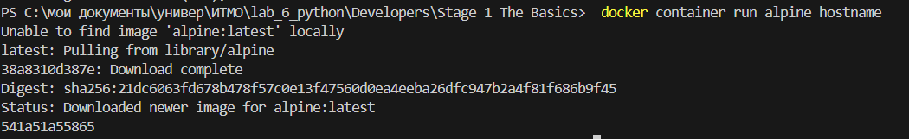
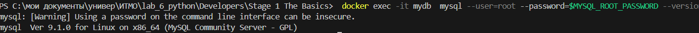
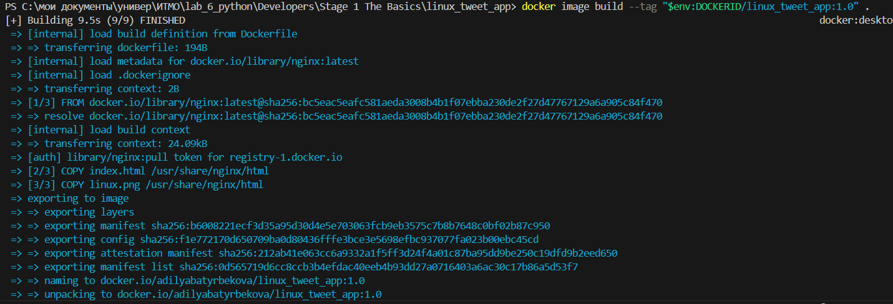
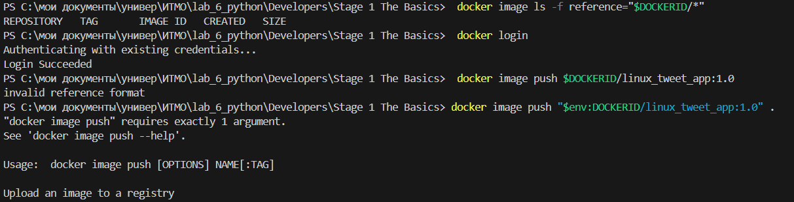
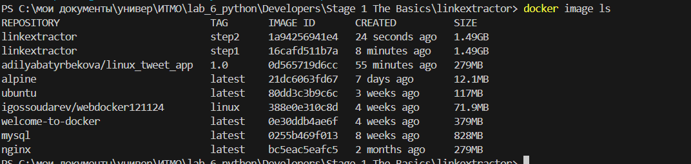
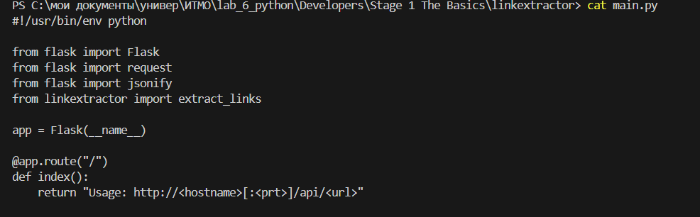
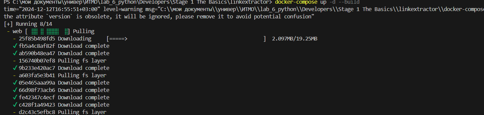

# Docker for Beginners - Linux
## Задача 0: Предпосылки
Клонируйте репозиторий GitHub лаборатории
```
git clone https://github.com/dockersamples/linux_tweet_app
```


## Задача 1: Запуск нескольких простых контейнеров Docker
Запуск одной задачи в контейнере Alpine Linux
```
 docker container run alpine hostname
```


Перечислите все контейнеры.
```
docker container ls --all
```


Запустите интерактивный контейнер Ubuntu
```
docker container run --interactive --tty --rm ubuntu bash
```
Выполните следующие команды в контейнере.
```
ls /
ps aux
cat /etc/issue
 exit
```


Запустить фоновый контейнер MySQL
```
 docker container run \
 --detach \
 --name mydb \
 -e MYSQL_ROOT_PASSWORD=my-secret-pw \
 mysql:latest
 ```


 Перечислите работающие контейнеры.
 ```
docker container ls
```

Вы можете проверить, что происходит в ваших контейнерах, используя пару встроенных команд Docker:
```
 docker container logs mydb
```


Рассмотрим процессы, протекающие внутри контейнера.
```
docker container top mydb
```


Выведите версию MySQL
```
 docker exec -it mydb \
 mysql --user=root --password=$MYSQL_ROOT_PASSWORD --version
```


```
docker exec -it mydb sh
mysql --user=root --password=$MYSQL_ROOT_PASSWORD --version
exit
```


## Задача 2: Упаковка и запуск пользовательского приложения с использованием Docke
Создайте простое изображение веб-сайта
```
cd ./linux_tweet_app
cat Dockerfile
```


```
$env:DOCKERID = "adilyabatyrbekova"
echo $env:DOCKERID
```


```
docker image build --tag "$env:DOCKERID/linux_tweet_app:1.0" .
```


```
 docker container run --detach --publish 80:80 --name linux_tweet_app --mount type=bind,source="$(pwd)",target=/usr/share/nginx/html "$env:DOCKERID/linux_tweet_app:1.0"
docker rm --force linux_tweet_app
 ```


 ## Задача 3: Изменить работающий веб-сайт
Запустите наше веб-приложение с помощью привязки монтирования
```
docker container run --detach --publish 80:80 --name linux_tweet_app --mount type=bind,source="$(pwd)",target=/usr/share/nginx/html "$env:DOCKERID/linux_tweet_app:1.0"
```


Изменить работающий веб-сайт
```
docker rm --force linux_tweet_app
docker container run `
--detach `
--publish 80:80 `
--name linux_tweet_app `
"$env:DOCKERID/linux_tweet_app:1.0"
docker rm --force linux_tweet_app
```
    

Обновить изображение
```
docker image build --tag "$env:DOCKERID/linux_tweet_app:2.0" .
docker image ls
```


Загрузите свои образы в Docker Hub
```
docker image ls -f reference="$DOCKERID/*"
docker login
docker image push $DOCKERID/linux_tweet_app:1.0
docker image push $DOCKERID/linux_tweet_app:2.0
```



# Application Containerization and Microservice Orchestration
### Установка сцены
```
git clone https://github.com/ibnesayeed/linkextractor.git
cd linkextractor
git checkout demo
```


## Шаг 0: Базовый скрипт извлечения ссылок
```
git checkout step0
tree
```


```
cat linkextractor.py
./linkextractor.py http://example.com/
ls -l linkextractor.py
python3 linkextractor.py
```


## Шаг 1: Контейнеризованный скрипт извлечения ссылок
```
git ls-tree -r step1 --name-only
cat Dockerfile
docker image build -t linkextractor:step1 .
docker image ls
docker container run -it --rm linkextractor:step1 http://example.com/
```


## Шаг 2: Модуль извлечения ссылок с полным URI и текстом привязки
```
git checkout step2
git ls-tree -r step2 --name-only
cat linkextractor.py
docker image build -t linkextractor:step2 .
docker image ls
docker container run -it --rm linkextractor:step2 https://training.play-with-docker.com/
```





## Шаг 3: API-сервис извлечения ссылок
```
git checkout step3
git ls-tree -r step3 --name-only
cat Dockerfile
cat main.py
docker image build -t linkextractor:step3 .
docker container run -d -p 5000:5000 --name=linkextractor linkextractor:step3
docker container ls
docker container rm -f linkextractor
```




## Шаг 4: API извлечения ссылок и службы веб-интерфейса
```
git checkout step4
git ls-tree -r step4 --name-only
cat docker-compose.yml
cat www/index.php
docker-compose up -d --build
docker container ls
git reset --hard
docker-compose down
```





## Шаг 5: Служба Redis для кэширования
```
git checkout step5
git ls-tree -r step5 --name-only
cat www/Dockerfile
cat docker-compose.yml
docker-compose up -d --build
docker-compose exec redis redis-cli monitor
git reset --hard
docker-compose down
```


## Шаг 6: замена службы API Python на Ruby
```
git checkout step6
git ls-tree -r step6 --name-only
cat api/linkextractor.rbA
cat api/Dockerfile
docker-compose up -d --build
docker-compose down
```


# Deploying a Multi-Service App in Docker Swarm Mode
## Инициируйте свой рой
```
docker swarm init --advertise-addr (Get-NetIPAddress -AddressFamily IPv4 | Where-Object { $_.InterfaceAlias -like "*Ethernet*" }).IPAddress
```


## Клонировать приложение для голосования
```
git clone https://github.com/docker/example-voting-app
```


## Развернуть стек
```
docker stack deploy --compose-file=docker-stack.yml voting_stack
docker stack ls
```


