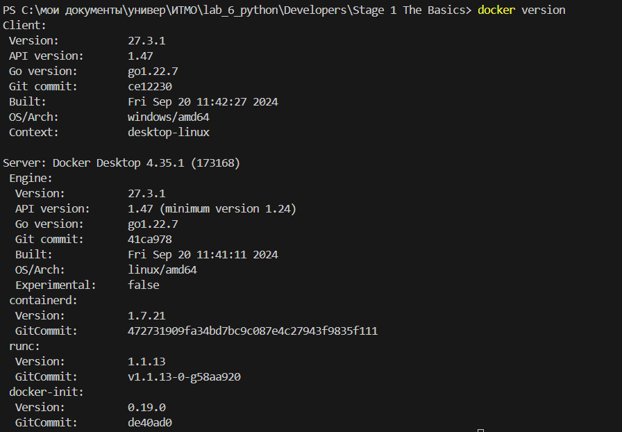
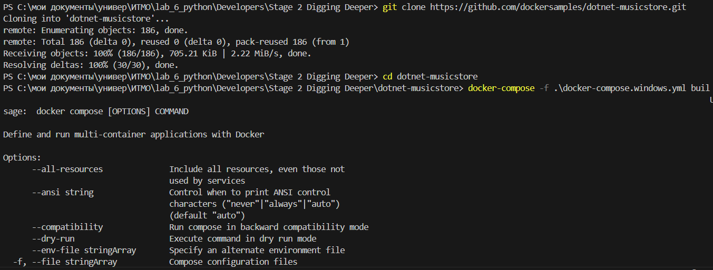
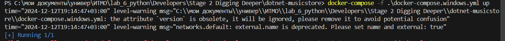
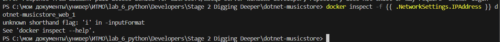

# Windows Container Basics
## Начало работы с контейнерами Windows
```
docker version
```


```
git clone https://github.com/dockersamples/dotnet-musicstore.git
cd dotnet-musicstore
docker-compose -f .\docker-compose.windows.yml build
docker-compose -f .\docker-compose.windows.yml up
docker inspect -f {{ .NetworkSettings.IPAddress }} dotnet-musicstore_web_1
```



