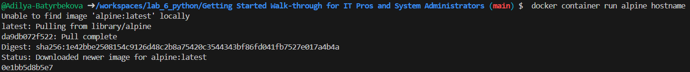
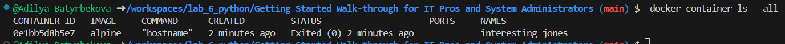
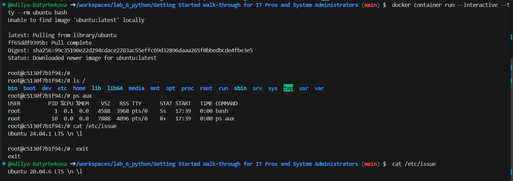

### Клонирование репозитория с GitHub лаборатории
``` git clone https://github.com/dockersamples/linux_tweet_app ```

### Запуск одной задачи в контейнере Alpine Linux
``` docker container run alpine hostname ```


``` docker container ls --all ``` 


### Запустите интерактивный контейнер Ubuntu
Запустите Docker-контейнер и получите доступ к его оболочке.
```  docker container run --interactive --tty --rm ubuntu bash ```


### Запустить фоновый контейнер MySQL
Запустите новый контейнер MySQL с помощью следующей команды.
