# Your First Linux Containers
## 1. Запуск первого контейнера
``` docker container run hello-world ```
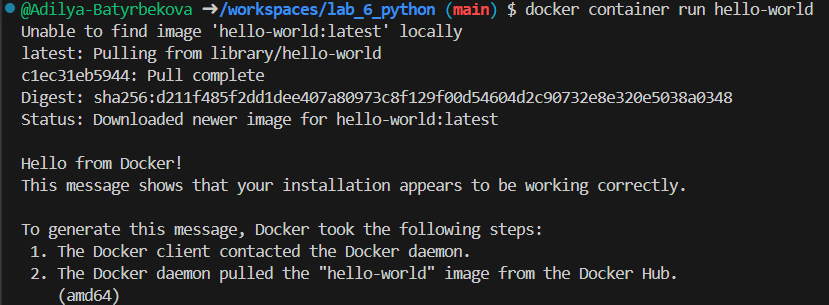

### 1.1 Образы Docker
``` docker image pull alpine ```
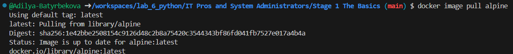

Просмотреть список всех образов в системе.
``` docker image ls ```
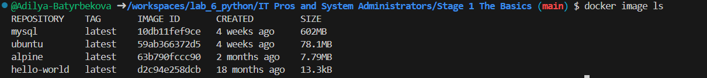

### 1.2 Запуск Docker-контейнера
``` docker container run alpine ls -l ```
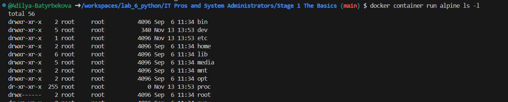

Тестирование различных команд
Список команд
```
docker container run alpine echo "hello from alpine"
docker container run alpine /bin/sh
docker container run -it alpine /bin/sh
docker container ls
docker container ls -a
```
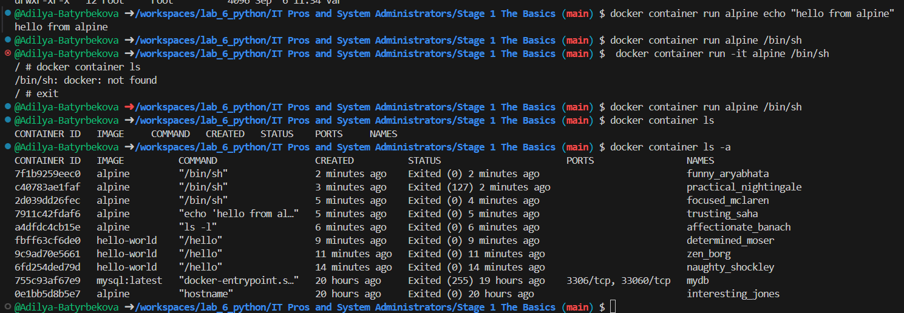

### 1.3 Изоляция контейнера
``` docker container run -it alpine /bin/ash ```
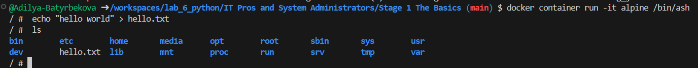

Демонстрация работы изоляции
``` docker container run alpine ls ```
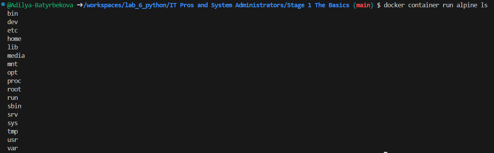

``` docker container ls -a ```
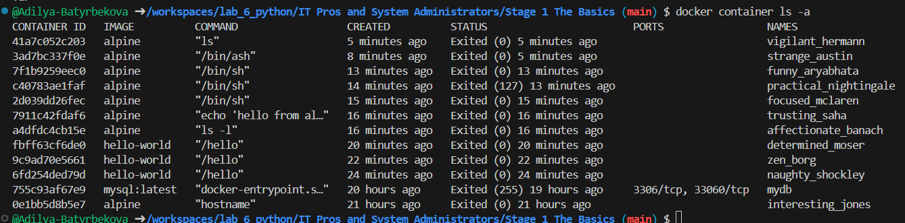

# Customizing Docker Images:
## Создание образа из контейнера
``` docker container run -ti ubuntu bash ```

Установим пакет figlet в этот контейнер
```
apt-get update
apt-get install -y figlet
figlet "hello docker"
```
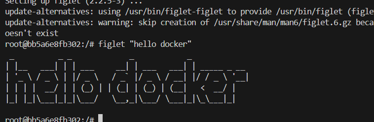

``` docker container ls -a ```
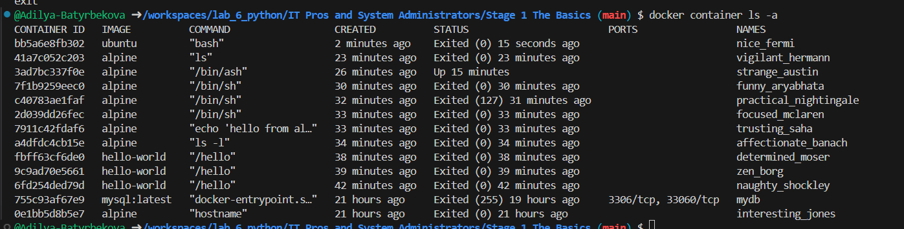

Выполнение списка команд 
``` 
docker container commit bb5a
docker image ls
docker image tag 210a ourfiglet
docker image ls
```
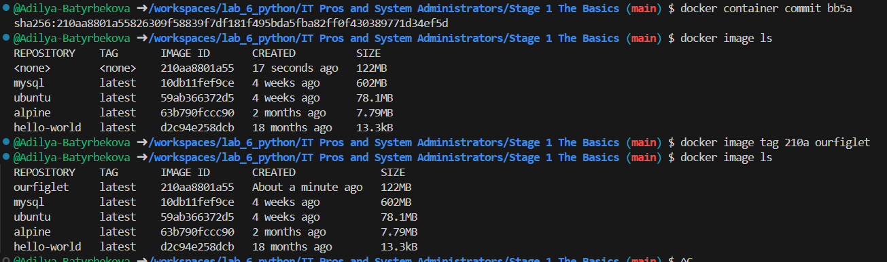

Теперь запустим контейнер на основе недавно созданного образа ourfiglet :
``` docker container run ourfiglet figlet hello ```
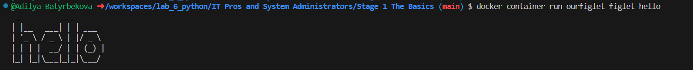

## Создание образа с помощью Dockerfile
