# Your First Linux Containers
## 1. Запуск первого контейнера
``` docker container run hello-world ```


### 1.1 Образы Docker
``` docker image pull alpine ```


Просмотреть список всех образов в системе.
``` docker image ls ```


### 1.2 Запуск Docker-контейнера
``` docker container run alpine ls -l ```


Тестирование различных команд
Список команд
```
docker container run alpine echo "hello from alpine"
docker container run alpine /bin/sh
docker container run -it alpine /bin/sh
docker container ls
docker container ls -a
```


### 1.3 Изоляция контейнера
``` docker container run -it alpine /bin/ash ```


Демонстрация работы изоляции
``` docker container run alpine ls ```


``` docker container ls -a ```


# Customizing Docker Images:
## Создание образа из контейнера
``` docker container run -ti ubuntu bash ```

Установим пакет figlet в этот контейнер
```
apt-get update
apt-get install -y figlet
figlet "hello docker"
```


``` docker container ls -a ```


Выполнение списка команд 
``` 
docker container commit bb5a
docker image ls
docker image tag 210a ourfiglet
docker image ls
```


Теперь запустим контейнер на основе недавно созданного образа ourfiglet :
``` docker container run ourfiglet figlet hello ```


## Создание образа с помощью Dockerfile
Создадим образ из Dockerfile и назовем его hello:v0.1
``` docker image build -t hello:v0.1 . ```
 
Затем мы запускаем контейнер, чтобы проверить правильность работы наших приложений:
``` docker container run hello:v0.1 ``` 
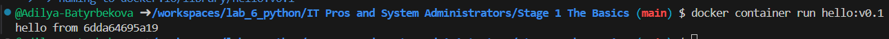

## Слои изображения
``` docker image history <image ID> ```
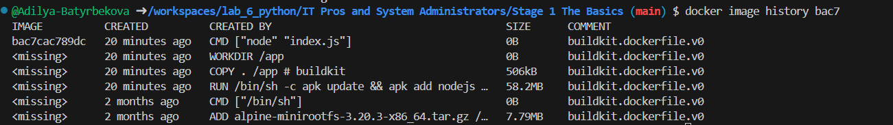

``` 
echo "console.log(\"this is v0.2\");" >> index.js
docker image build -t hello:v0.2 .
```
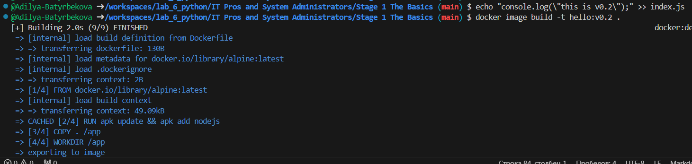

## Проверка изображения
``` docker image inspect alpine ```
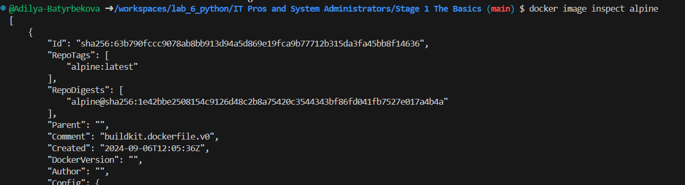


Получим список слоев:
``` docker image inspect --format "{{ json .RootFS.Layers }}" alpine ```
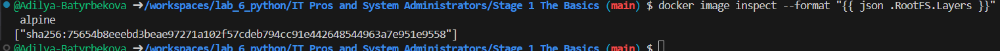

Теперь посмотрим на наше пользовательское изображение Hello.
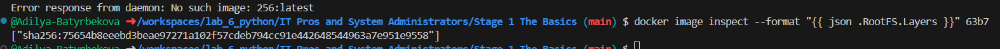

# Deploy and Managing Multiple Containers
## Инициализируйте свой рой
Инициализация Docker Swarm Mode
``` docker swarm init --advertise-addr $(hostname -i) ```
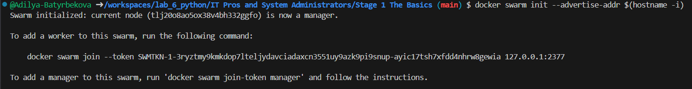

Показать участников Swarm
``` docker node ls ```
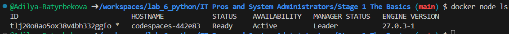

## Клонировать приложение для голосования
```
git clone https://github.com/docker/example-voting-app
cd example-voting-app 
```
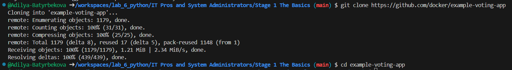

### Развернуть стек
``` cat docker-stack.yml ```
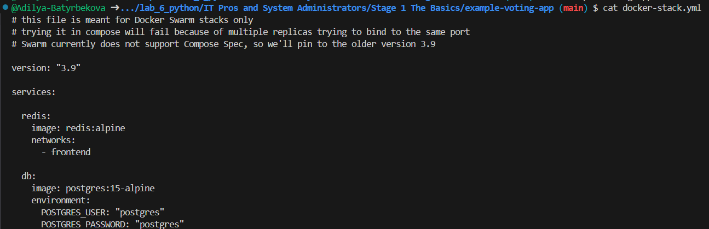

```
docker stack deploy --compose-file=docker-stack.yml voting_stack
docker stack ls
docker stack services voting_stack
docker service ps voting_stack_vote
```
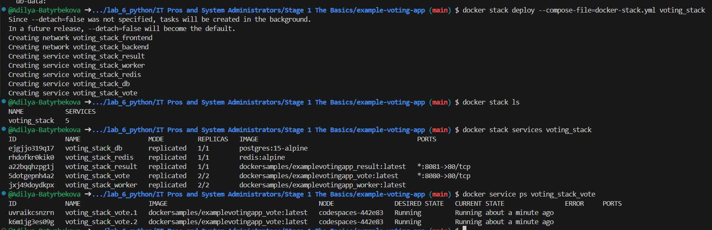
### Масштабирование приложения
```
docker service scale voting_stack_vote=5
ocker stack services voting_stack
```
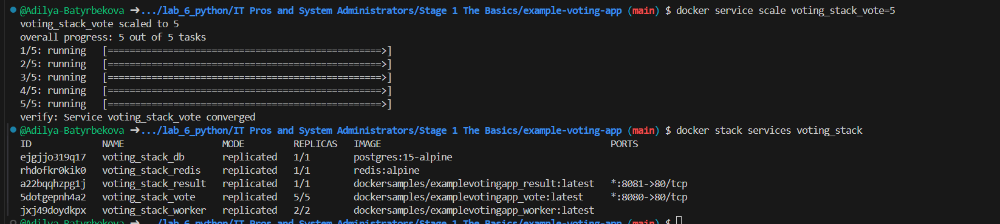
