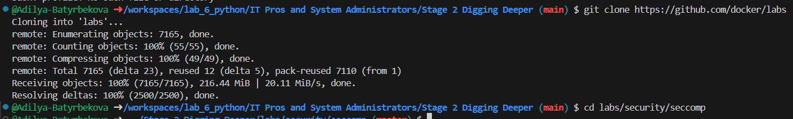
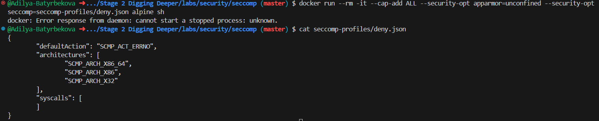
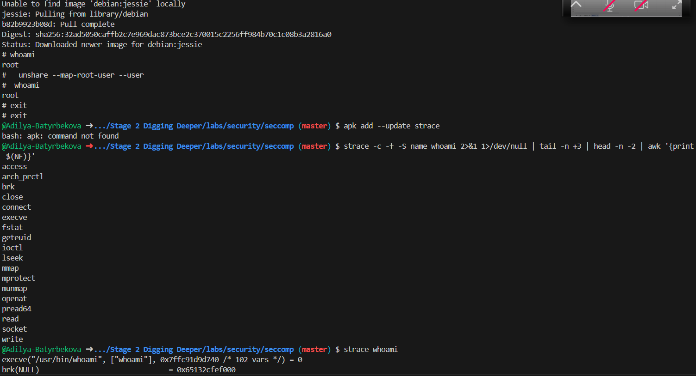
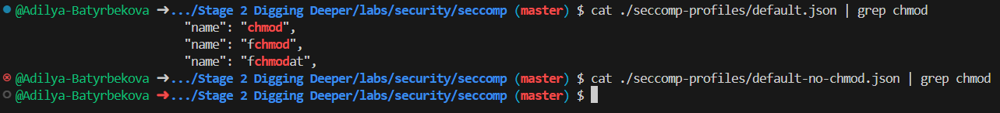
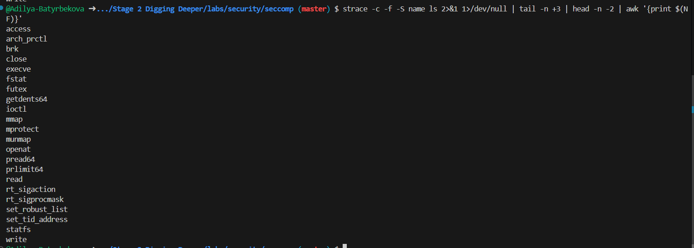

# Seccomp profiles
## Шаг 1: Клонируйте репозиторий GitHub лабораторий
```
git clone https://github.com/docker/labs
cd labs/security/seccomp
```

## Шаг 2: Тестирование профиля seccomp
``` 
docker run --rm -it --cap-add ALL --security-opt apparmor=unconfined --security-opt seccomp=seccomp-profiles/deny.json alpine sh
cat seccomp-profiles/deny.json
```


## Шаг 3: Запустите контейнер без профиля seccomp
``` 
docker run --rm -it --security-opt seccomp=unconfined debian:jessie sh
whoami
unshare --map-root-user --user
exit
exit
apk add --update strace
strace -c -f -S name whoami 2>&1 1>/dev/null | tail -n +3 | head -n -2 | awk '{print $(NF)}'
strace whoami
```


## Шаг 4: Выборочное удаление системных вызовов
```
docker run --rm -it --security-opt seccomp=./seccomp-profiles/default-no-chmod.json alpine sh
chmod 777 / -v
exit
docker run --rm -it --security-opt seccomp=./seccomp-profiles/default.json alpine sh
chmod 777 / -v
exit
cat ./seccomp-profiles/default.json | grep chmod
cat ./seccomp-profiles/default-no-chmod.json | grep chmod
```


## Шаг 5: Напишите профиль seccomp
```
strace -c -f -S name ls 2>&1 1>/dev/null | tail -n +3 | head -n -2 | awk '{print $(NF)}'
```


