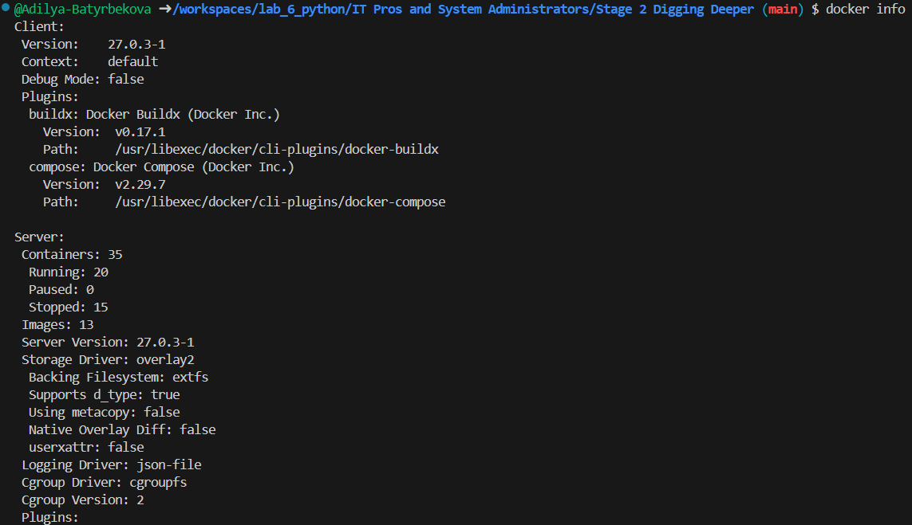
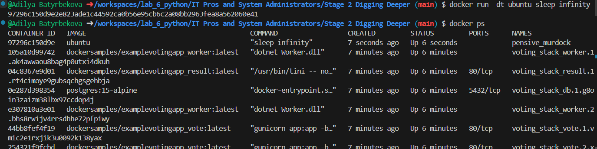

# Seccomp profiles
## Шаг 1: Клонируйте репозиторий GitHub лабораторий
```
git clone https://github.com/docker/labs
cd labs/security/seccomp
```

## Шаг 2: Тестирование профиля seccomp
``` 
docker run --rm -it --cap-add ALL --security-opt apparmor=unconfined --security-opt seccomp=seccomp-profiles/deny.json alpine sh
cat seccomp-profiles/deny.json
```


## Шаг 3: Запустите контейнер без профиля seccomp
``` 
docker run --rm -it --security-opt seccomp=unconfined debian:jessie sh
whoami
unshare --map-root-user --user
exit
exit
apk add --update strace
strace -c -f -S name whoami 2>&1 1>/dev/null | tail -n +3 | head -n -2 | awk '{print $(NF)}'
strace whoami
```


## Шаг 4: Выборочное удаление системных вызовов
```
docker run --rm -it --security-opt seccomp=./seccomp-profiles/default-no-chmod.json alpine sh
chmod 777 / -v
exit
docker run --rm -it --security-opt seccomp=./seccomp-profiles/default.json alpine sh
chmod 777 / -v
exit
cat ./seccomp-profiles/default.json | grep chmod
cat ./seccomp-profiles/default-no-chmod.json | grep chmod
```


## Шаг 5: Напишите профиль seccomp
```
strace -c -f -S name ls 2>&1 1>/dev/null | tail -n +3 | head -n -2 | awk '{print $(NF)}'
```


# Linux Kernel Capabilities and Docker

## Шаг 1: Тестирование возможностей Docker
``` 
docker run --rm -it alpine chown nobody /
docker run --rm -it --cap-drop ALL --cap-add CHOWN alpine chown nobody /
docker run --rm -it --cap-drop CHOWN alpine chown nobody /
docker run --rm -it --cap-add chown -u nobody alpine chown nobody /
```


## Шаг 2: Дополнительно для экспертов
```
docker run --rm -it alpine sh -c 'apk add -U libcap; capsh --print'
docker run --rm -it alpine sh -c 'apk add -U libcap;capsh --help'
```


# Docker Networking Hands-on Lab
## Раздел №1 — Основы сетевых технологий
### Шаг 1: Сетевая команда Docker
```
docker network
```


### Шаг 2: Список сетей
```
docker network ls
```


### Шаг 3: Проверка сети
```
docker network inspect bridge
```


### Шаг 4: Перечислите подключаемые модули сетевых драйверов
```
docker info
```


## Раздел №2 – Сетевое взаимодействие мостов
### Шаг 1: Основы
Каждая чистая установка Docker поставляется с предварительно созданной сетью, называемой bridge . Проверьте это с помощью docker network ls.
```
docker network ls
```


### Шаг 2: Подключите контейнер
Создайте новый контейнер, запустив
```
docker run -dt ubuntu sleep infinity
docker ps
docker network inspect bridge
```



### Шаг 3: Проверка сетевого подключения
```
docker ps
docker exec -it 9729  /bin/bash
apt-get update && apt-get install -y iputils-ping
 ping -c5 www.github.com
 exit
 docker stop 9729
```


### Шаг 4: Настройте NAT для внешнего подключения
Запустите новый контейнер на основе официального образа NGINX, запустив
```
docker run --name web1 -d -p 8080:80 nginx
```
Проверьте состояние контейнера и сопоставление портов, запустив
```
docker ps
curl 127.0.0.1:8080
``` 


## Раздел №3 – Наложенные сети
### Шаг 1: Основы
```
docker swarm init --advertise-addr $(hostname -i)
docker node ls
```


### Шаг 2: Создание оверлейной сети
```
docker network create -d overlay overnet
docker network ls
docker network inspect overnet
```


### Шаг 3: Создайте услугу
```
docker service create --name myservice \
--network overnet \
--replicas 2 \
ubuntu sleep infinity
docker service ls
docker service ps myservice
docker network ls
docker network inspect overnet
```

